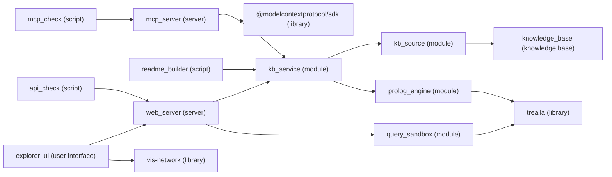

<!-- Generated by `npm run readme` from the knowledge base. Change kb/*.pl, file headers or package.json, not this file. -->

# Liquidity House Knowledge Explorer

## Overview

The Liquidity House Knowledge Explorer exists to make onboarding, platform, risk and system knowledge explorable and explainable, for people in the explorer and for AI agents over MCP, from one Prolog knowledge base.

Its knowledge is organised in these domains: Onboarding, RiskX platform, Risk and System.



## Components

| Component | Kind | Runtime | Source file | Description |
| --- | --- | --- | --- | --- |
| `explorer_ui` | user interface | the browser | `public/app.ts` | The explorer UI: draws and filters the role-scoped knowledge the server sends, and shows how every derived fact was reached |
| `web_server` | server | Node.js | `server.ts` | Knowledge explorer server: the only place the knowledge base is reasoned over |
| `mcp_server` | server | Node.js | `mcp-server.ts` | MCP server: progressive access to the liquidity.house knowledge base for AI agents |
| `kb_service` | module | Node.js | `lib/kb-service.ts` | The one live engine both servers share, rebuilt when the KB files change, with answers cached per KB version |
| `kb_source` | module | Node.js | `lib/kb-source.ts` | The single knowledge source: the KB files in kb/manifest.json joined into one program, plus facts generated from what the repository already records, versioned by content hash |
| `prolog_engine` | module | Node.js | `lib/prolog.ts` | Trealla Prolog (WASM) engine wrapper: consults the KB program and runs api/1 requests |
| `query_sandbox` | module | Node.js | `lib/sandbox.ts` and `lib/query-worker.ts` | Free-form queries (the explorer's Query view) run in a throwaway worker with a time limit, so a runaway goal or halt/0 cannot block or kill the shared engine |
| `kb_types` | module | Node.js | `lib/kb-types.ts` | Shapes of the JSON the knowledge base answers with (kb/api.pl) |
| `knowledge_base` | knowledge base | — | — | Hold every fact and rule, the vocabulary explanations are built from, and the requests the servers ask |
| `api_check` | script | Node.js | `scripts/api-check.ts` | End-to-end check of the REST endpoints and their role scoping |
| `mcp_check` | script | Node.js | `scripts/mcp-check.ts` | Smoke test for the MCP server over real stdio: lists the tools, then walks the discover → focus → verify → explain sequence an agent would follow |
| `code_export` | script | Node.js | `scripts/export-code.ts` | Bundles all application source into export/_code.txt for sharing as a single file |
| `readme_builder` | script | Node.js | `scripts/readme.ts` | Composes README.md from the knowledge base: every heading, sentence and table cell comes from kb/*.pl |

## Running it

The required version of Node.js is >=23.6.

```bash
npm install
npm start
```

| Package script | Command | Description |
| --- | --- | --- |
| `npm run start` | `node server.ts` | Knowledge explorer server: the only place the knowledge base is reasoned over |
| `npm run dev` | `node --watch server.ts` | Run the web server and restart it whenever a source file changes |
| `npm run typecheck` | `tsc --noEmit` | Type-check the servers, the explorer and the scripts |
| `npm run export` | `node scripts/export-code.ts` | Bundles all application source into export/_code.txt for sharing as a single file |
| `npm run mcp` | `node mcp-server.ts` | MCP server: progressive access to the liquidity.house knowledge base for AI agents |
| `npm run mcp:check` | `node scripts/mcp-check.ts` | Smoke test for the MCP server over real stdio: lists the tools, then walks the discover → focus → verify → explain sequence an agent would follow |
| `npm run api:check` | `node scripts/api-check.ts` | End-to-end check of the REST endpoints and their role scoping |
| `npm run readme` | `node scripts/readme.ts` | Composes README.md from the knowledge base: every heading, sentence and table cell comes from kb/*.pl |
| `npm run readme:check` | `node scripts/readme.ts --check` | Fail when README.md differs from what the knowledge base would generate, for use in CI |

## Who sees what

| Identity mode | Setting | Description |
| --- | --- | --- |
| Dev identity | `KB_AUTH=dev` | Let the explorer's user picker choose who is asking; for local use only, since anyone can pick anyone |
| Proxy identity | `KB_AUTH=proxy` | Trust an email header set by an auth proxy (X-Forwarded-Email, or KB_EMAIL_HEADER) and match it to a person through email_address/2; the proxy must strip that header from client requests |

Who may call each endpoint follows one rule: The role can call the endpoint when the endpoint requires the feature and the role has the feature.

| Role | Domain | Feature |
| --- | --- | --- |
| Risk officer | Risk and RiskX platform | `public`, `signed_in` and `table` |
| Developer | Onboarding, RiskX platform, Risk and System | `public`, `signed_in`, `table`, `console` and `technical` |
| Administrator | Onboarding, RiskX platform, Risk and System | `public`, `signed_in`, `table`, `console` and `technical` |

## Knowledge files

The knowledge base exists to hold every fact and rule, the vocabulary explanations are built from, and the requests the servers ask.

| File | Summary |
| --- | --- |
| `onboarding.pl` | What a new joiner sets up, who gets them in, and where things live |
| `kb/riskx_kb.pl` | RiskX ground facts and risk rules |
| `kb/progress.pl` | What each person or agent has already set up |
| `kb/system.pl` | The explorer and its servers, described as knowledge |
| `kb/lexicon.pl` | The primitive vocabulary every label and explanation is built from |
| `kb/schema.pl` | What is shown, where it belongs, how it looks and who sees it |
| `kb/explain.pl` | Syllog-style meta-interpreter and a sentence composer |
| `kb/api.pl` | The knowledge-graph bridge and the JSON requests the web and MCP servers ask |
| `kb/readme.pl` | How README.md is composed from the knowledge base |

## REST API

| Endpoint | Feature | Knowledge request | MCP tool |
| --- | --- | --- | --- |
| `GET /api/health` | `public` | — | — |
| `GET /api/session` | `signed_in` | `session` | — |
| `GET /api/graph` | `signed_in` | `graph` | — |
| `GET /api/explain/:entity` | `signed_in` | `explain` | — |
| `GET /api/overview` | `signed_in` | `overview` | `get_knowledge_overview` |
| `GET /api/context/:entity` | `signed_in` | `context` | `query_entity_context` |
| `GET /api/verify/:service` | `signed_in` | `verify` | `verify_task_onboarding` |
| `GET /api/explain-goal` | `signed_in` | `explain_goal` | `explain_rule_or_decision` |
| `POST /api/query` | `console` | — | — |
| `GET /api/kb` | `technical` | — | — |
| `GET /api/kb.pl` | `technical` | — | — |

## MCP server for AI agents

Server 'mcp_server' is registered for Claude Code in .mcp.json.

| MCP tool | Knowledge request | Endpoint | Description |
| --- | --- | --- | --- |
| `get_knowledge_overview` | `overview` | `GET /api/overview` | Start here: list the domains a role can see, their relations, their entities by type, the services, and every rule in plain English |
| `query_entity_context` | `context` | `GET /api/context/:entity` | Return the facts and derived conclusions within a few hops of one entity as triples, nearest first, with the type of every entity mentioned |
| `verify_task_onboarding` | `verify` | `GET /api/verify/:service` | Infer everything needed to work on a service and report, for each item, what to do, its link, who can invite you, why it is needed, and whether it is done |
| `explain_rule_or_decision` | `explain_goal` | `GET /api/explain-goal` | Prove a goal such as soft_credit_limit(dope, Limit) and return its bindings with an English trace of the facts, rules and calculations used, or describe a rule by name |

## Using the explorer

- **Stated and derived**: Mark every connection as stated (solid line) or derived by a rule (dashed): hover a connection for how it is inferred, click it for why it holds.
- **Views**: Switch between the mind map, the hierarchy in four directions, the triple table and the query console.
- **Focus**: Re-centre on an entity by clicking or searching, go back through history, and set the depth from one to five hops.
- **Scope**: Toggle domains, single relations, derived facts, and value, link and description leaves.
- **Entity types**: Show or hide each type of entity and change its colour and shape.
- **Per-user settings**: Remember settings for each user and start newly visible domains ticked.
- **Shareable state**: Keep the user, view, focus and depth in the URL, so a view can be shared.

## Working on the knowledge base

- State a fact only when nothing else records it, and add a rule for anything that follows from other facts.
- Generate what the repository already records (KB files, packages, npm scripts, file descriptions) instead of restating it.
- Compose every sentence, rule description and calculation from lexicon primitives, never from sentence templates.
- Add a relation with its facts, one kb_predicate/3 line in schema.pl, and a noun/2 or verb/2 only when the humanised name reads badly.
- Describe each file in the first sentence of its header comment, of medium length; components, the README and the explorer read it from there.
- Format text into a fresh variable and then unify (Url = Url0), because in Trealla format(atom(Bound), …) inside a clause succeeds without checking.
- Declare rules the explorer explains as dynamic, because clause/2 cannot read static predicates in Trealla.
- Change the knowledge (kb/*.pl, file headers, package.json) and run npm run readme, rather than editing README.md.
- Illustrative sample data: `nordbet`, `spinhaus` and `vegaplay`.
