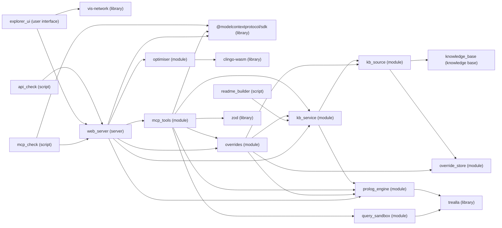

<!-- Generated by `npm run readme` from the knowledge base. Change kb/*.pl, file headers or package.json, not this file. -->

# Knowledge Explorer

## Overview

The Knowledge Explorer exists to explore and explain how knowledge connects, for people in the explorer and for AI agents over MCP.

Its knowledge is organised in these domains: Onboarding, RiskX platform, Risk and Knowledge Explorer.



## Components

| Component | Kind | Runtime | Source file | Description |
| --- | --- | --- | --- | --- |
| `explorer_ui` | user interface | the browser | `public/app.ts` | The explorer UI: draws and filters the role-scoped knowledge the server sends, and shows how every derived fact was reached |
| `web_server` | server | Node.js | `server.ts` | Knowledge explorer server: the only place the knowledge base is reasoned over |
| `mcp_tools` | module | Node.js | `lib/mcp-tools.ts` | The MCP tools for AI agents, served by the web server at POST /mcp (Streamable HTTP, stateless), so agents reach them by URL: localhost now, an AdminX endpoint later |
| `overrides` | module | Node.js | `lib/overrides.ts` | Local overrides as operations, for the explorer (REST) and agents (MCP) alike: check facts against the knowledge base, then add, remove, edit or undo them in the override store, or mark a service's setup steps done |
| `override_store` | module | Node.js | `lib/override-store.ts` | The local overrides: facts added or removed on this machine, kept in state/overrides.json (which git ignores) and applied whenever the knowledge base is loaded, never written into the pack files |
| `kb_service` | module | Node.js | `lib/kb-service.ts` | The one live engine the web server and the scripts share, rebuilt when the KB files change, with answers cached per KB version |
| `kb_source` | module | Node.js | `lib/kb-source.ts` | The single knowledge source: the engine's files and the knowledge packs in kb/manifest.json joined into one program, plus facts generated from what the repository already records, versioned by content hash |
| `prolog_engine` | module | Node.js | `lib/prolog.ts` | Trealla Prolog (WASM) engine wrapper: consults the KB program and runs api/1 requests |
| `query_sandbox` | module | Node.js | `lib/sandbox.ts` and `lib/query-worker.ts` | Free-form queries (the MCP query_knowledge_base tool) run in a throwaway worker with a time limit, so a runaway goal or halt/0 cannot block or kill the shared engine |
| `kb_types` | module | Node.js | `lib/kb-types.ts` | Shapes of the JSON the knowledge base answers with (kb/api.pl) |
| `optimiser` | module | Node.js | `lib/optimiser.ts` and `kb/plan.lp` | Chooses which compression candidates to apply: kb/plan.lp, solved by clingo, finds the set that saves the most symbols within the asker's constraints, then the next best ones |
| `knowledge_base` | knowledge base | — | — | Hold the engine that reasons and explains (kb/) and the knowledge packs it loads (knowledge/): every fact and rule, the vocabulary explanations are built from, and the requests it answers |
| `api_check` | script | Node.js | `scripts/api-check.ts` | End-to-end check of the REST endpoints and their role scoping |
| `mcp_check` | script | Node.js | `scripts/mcp-check.ts` | Smoke test for the MCP tools at the web server's POST /mcp, on servers started on spare ports: lists the tools, walks the discover → focus → verify → explain sequence an agent would follow, and checks that free-form queries are answered, refused outside their role and contained in the sandbox, that a signed-in person is held to their role, and that dev mode answers local clients only; then that progress and local changes to facts are recorded (in a scratch state file, never the real one), refused where they should be, and undone |
| `code_export` | script | Node.js | `scripts/export-code.ts` | Bundles all application source into export/_code.txt for sharing as a single file |
| `readme_builder` | script | Node.js | `scripts/readme.ts` | Composes README.md from the knowledge base: every heading, sentence and table cell comes from the knowledge packs |

## Running it

The required version of Node.js is >=23.6.

```bash
npm install
npm start
```

| Package script | Command | Description |
| --- | --- | --- |
| `npm run start` | `node server.ts` | Knowledge explorer server: the only place the knowledge base is reasoned over |
| `npm run dev` | `node --watch server.ts` | Run the web server and restart it whenever a source file changes |
| `npm run typecheck` | `tsc --noEmit` | Type-check the server, the explorer and the scripts |
| `npm run export` | `node scripts/export-code.ts` | Bundles all application source into export/_code.txt for sharing as a single file |
| `npm run mcp:check` | `node scripts/mcp-check.ts` | Smoke test for the MCP tools at the web server's POST /mcp, on servers started on spare ports: lists the tools, walks the discover → focus → verify → explain sequence an agent would follow, and checks that free-form queries are answered, refused outside their role and contained in the sandbox, that a signed-in person is held to their role, and that dev mode answers local clients only; then that progress and local changes to facts are recorded (in a scratch state file, never the real one), refused where they should be, and undone |
| `npm run api:check` | `node scripts/api-check.ts` | End-to-end check of the REST endpoints and their role scoping |
| `npm run readme` | `node scripts/readme.ts` | Composes README.md from the knowledge base: every heading, sentence and table cell comes from the knowledge packs |
| `npm run readme:check` | `node scripts/readme.ts --check` | Fail when README.md differs from what the knowledge base would generate, for use in CI |

## Who sees what

| Identity mode | Setting | Description |
| --- | --- | --- |
| Dev identity | `KB_AUTH=dev` | Let the explorer's user picker choose who is asking, and MCP calls name their role in scope; for local use only, since anyone can pick anyone, so POST /mcp then answers local clients only |
| Proxy identity | `KB_AUTH=proxy` | Trust an email header set by an auth proxy (X-Forwarded-Email, or KB_EMAIL_HEADER) and match it to a person through email_address/2, whose role the MCP tools then answer in; the proxy must strip that header from client requests |

Who may call each endpoint follows one rule: The role can call the endpoint when the endpoint requires the feature and the role has the feature.

| Role | Domain | Feature |
| --- | --- | --- |
| Risk officer | Risk and RiskX platform | `public`, `signed_in` and `table` |
| Developer | Onboarding, RiskX platform, Risk and Knowledge Explorer | `public`, `signed_in`, `table`, `console` and `technical` |
| Administrator | Onboarding, RiskX platform, Risk and Knowledge Explorer | `public`, `signed_in`, `table`, `console` and `technical` |

## Knowledge files

The knowledge base exists to hold the engine that reasons and explains (kb/) and the knowledge packs it loads (knowledge/): every fact and rule, the vocabulary explanations are built from, and the requests it answers.

| File | Summary |
| --- | --- |
| `kb/core.pl` | What every knowledge pack shares: kinds of knowledge, entity typing and roles |
| `kb/lexicon.pl` | The primitive vocabulary every label and explanation is built from |
| `kb/explain.pl` | Syllog-style meta-interpreter and a sentence composer |
| `kb/api.pl` | The knowledge-graph bridge and the JSON requests the web server asks |
| `kb/audit.pl` | What is stated, what is derived, and where the same knowledge could be said in fewer symbols |
| `knowledge/liquidity_house` | Liquidity House's onboarding, platform and risk knowledge: what a new joiner sets up and who gets them in, how the services fit together, and how operators' limits and warnings follow from their figures |
| `knowledge/liquidity_house/onboarding.pl` | What a new joiner sets up, who gets them in, and where things live |
| `knowledge/liquidity_house/riskx.pl` | RiskX ground facts and risk rules |
| `knowledge/liquidity_house/schema.pl` | The Liquidity House pack's domains, relations, entity types, roles and accounts |
| `knowledge/liquidity_house/vocabulary.pl` | The Liquidity House pack's words: what its concepts, relations, people and units are called |
| `knowledge/knowledge_explorer` | The knowledge explorer described as knowledge: its components, endpoints, MCP tools, identity modes and practices, from which README.md is composed |
| `knowledge/knowledge_explorer/explorer.pl` | The knowledge explorer and its server, described as knowledge |
| `knowledge/knowledge_explorer/schema.pl` | The explorer pack's domain, relations and entity types: the knowledge explorer itself |
| `knowledge/knowledge_explorer/vocabulary.pl` | The explorer pack's words: what the explorer's parts, relations and README sections are called |
| `knowledge/knowledge_explorer/readme.pl` | How README.md is composed from the knowledge base |

## REST API

| Endpoint | Feature | Knowledge request | MCP tool |
| --- | --- | --- | --- |
| `GET /api/health` | `public` | — | — |
| `GET /api/session` | `signed_in` | `session` | — |
| `GET /api/graph` | `signed_in` | `graph` | — |
| `GET /api/explain/:entity` | `signed_in` | `explain` | — |
| `GET /api/overview` | `signed_in` | `overview` | `get_knowledge_overview` |
| `GET /api/context/:entity` | `signed_in` | `context` | `query_entity_context` |
| `GET /api/verify/:service` | `signed_in` | `verify` | `verify_task_onboarding` |
| `GET /api/explain-goal` | `signed_in` | `explain_goal` | `explain_rule_or_decision` |
| `GET /api/kb` | `technical` | — | — |
| `GET /api/kb.pl` | `technical` | — | — |
| `GET /api/audit` | `technical` | `audit` | — |
| `POST /api/plan` | `technical` | — | — |
| `GET /api/overrides` | `technical` | `overrides` | — |
| `POST /api/overrides` | `technical` | `fact_check` | `change_facts` |
| `POST /api/progress` | `signed_in` | `progress_plan` | `record_progress` |
| `POST /mcp` | `signed_in` | — | — |

## MCP tools for AI agents

Server 'web_server' offers the MCP tools over transport 'streamable_http'. Server 'web_server' is registered for Claude Code in .mcp.json.

| MCP tool | Knowledge request | Endpoint | Description |
| --- | --- | --- | --- |
| `get_knowledge_overview` | `overview` | `GET /api/overview` | Start here: list the domains a role can see, their relations, their entities by type, the services, and every rule in plain English |
| `query_entity_context` | `context` | `GET /api/context/:entity` | Return the facts and derived conclusions within a few hops of one entity as triples, nearest first, with the type of every entity mentioned |
| `verify_task_onboarding` | `verify` | `GET /api/verify/:service` | Infer everything needed to work on a service and report, for each item, what to do, its link, who can invite you, why it is needed, and whether it is done |
| `explain_rule_or_decision` | `explain_goal` | `GET /api/explain-goal` | Prove a goal such as soft_credit_limit(dope, Limit) and return its bindings with an English trace of the facts, rules and calculations used, or describe a rule by name |
| `query_knowledge_base` | `query` | — | Run any Prolog goal against the whole knowledge base, in a throwaway sandbox with a time limit, and list every answer; for direct exploration by developers, past the role scoping the other tools apply |
| `record_progress` | `progress_plan` | `POST /api/progress` | Mark the steps of setting up a service done or not done for a person, as local completed/2 facts, so their progress shows at once in the explorer and in verify_task_onboarding; marking every step not done resets the service for a run from scratch |
| `change_facts` | `fact_check` | `POST /api/overrides` | Add, edit or remove facts on this machine only, from Prolog text or a URL, or undo such changes; they show in the explorer as local overrides, marked with who made them, until someone writes them into a pack |

## Using the explorer

- **Stated and derived**: Mark every connection as stated (solid line) or derived by a rule (dashed): hover a connection for how it is inferred, click it for why it holds.
- **Views**: Switch between the mind map, the hierarchy in four directions, the triple table and the audit.
- **Focus**: Re-centre on an entity by clicking or searching, go back through history, and set the depth from one to five hops.
- **Scope**: Toggle domains, single relations, derived facts, and value, link and description leaves.
- **Entity types**: Show or hide each type of entity and change its colour and shape.
- **Per-user settings**: Remember settings for each user and start newly visible domains ticked.
- **Shareable state**: Keep the user, view, focus and depth in the URL, so a view can be shared.
- **Knowledge audit**: Count what is stated, generated and derived in symbols, open any relation beside it (its rule, what it reads and is read by, its facts), list compression candidates by the symbols they would save, and let an optimiser choose the best set under constraints.
- **Local overrides**: Change facts here without editing the packs: paste facts or load them from a URL, edit or remove a fact from its card, and undo any change; changed facts are outlined in gold with an i saying who changed them, when and how, and the kinds filter can hide them.
- **Setup checklist**: Tick off the steps of setting up a service, as the person picked at the top and in their role; ticks are local overrides shared with agents over MCP.

## Working on the knowledge base

- State a fact only when nothing else records it, and add a rule for anything that follows from other facts.
- Generate what the repository already records (knowledge files and packs, packages, npm scripts, file descriptions, imports, and the code that implements each endpoint and tool) instead of restating it, each generated fact pointing to the line it was read from.
- Compose every sentence, rule description and calculation from lexicon primitives, never from sentence templates.
- Add a relation with its facts, one kb_predicate/3 line in its pack's schema.pl, and a noun/2 or verb/2 in the pack's vocabulary.pl only when the humanised name reads badly.
- Describe each file in the first sentence of its header comment, of medium length; components, the README and the explorer read it from there.
- Format text into a fresh variable and then unify (Url = Url0), because in Trealla format(atom(Bound), …) inside a clause succeeds without checking.
- Declare rules the explorer explains as dynamic, because clause/2 cannot read static predicates in Trealla.
- Ask predicate_property/2 only under negation (\+ \+ to keep the answer), never catch errors from clause/2, and walk terms with separate clauses and functor/3 and arg/3 rather than if-then-else or =.., because in Trealla these leave or lose bindings when backtracking.
- Change the knowledge (knowledge packs, file headers, package.json) and run npm run readme, rather than editing README.md.
- Look at the audit before adding facts: a candidate that saves symbols means knowledge is repeated, and a rule that saves none is kept for what it explains.
- Try a change as a local override first (in the explorer or with change_facts), and write it into its pack once it holds up; state/ is never committed.
- Illustrative sample data: `nordbet`, `spinhaus` and `vegaplay`.
